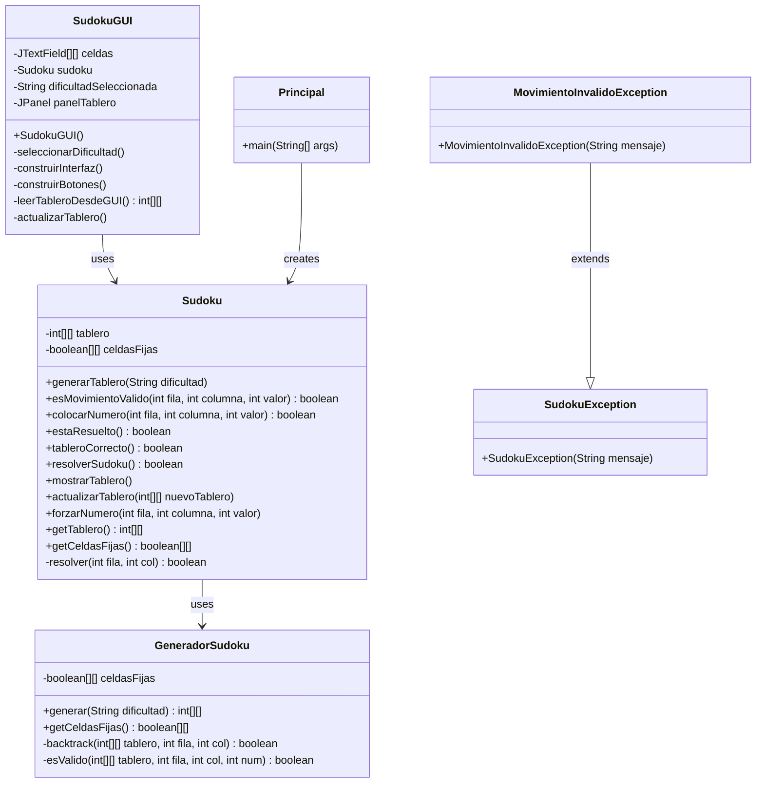

# 🧩 Proyecto Sudoku – Documentación Técnica Completa

## 📌 1. Análisis de Requerimientos

### 🎯 Objetivo
Desarrollar una aplicación de escritorio en Java para jugar al Sudoku. Esta debe permitir generar tableros por dificultad, validar jugadas, resolver automáticamente y proporcionar una interfaz gráfica interactiva.

### ✅ Requisitos Funcionales

| Código | Descripción | Prioridad |
|--------|-------------|-----------|
| RF1 | Generar tableros Sudoku según una dificultad seleccionada (fácil, medio, difícil) | Alta |
| RF2 | Permitir al usuario introducir números en celdas no fijas | Alta |
| RF3 | Validar que el número introducido es válido según reglas de Sudoku | Alta |
| RF4 | Resolver automáticamente el tablero si se desea | Media |
| RF5 | Comprobar si el tablero está correctamente resuelto | Alta |
| RF6 | Mostrar el tablero y permitir interacción mediante interfaz gráfica | Alta |
| RF7 | Reiniciar el juego con nueva dificultad | Media |
| RF8 | Diferenciación visual entre celdas fijas y editables | Media |

### ❗ Requisitos No Funcionales

| Código | Descripción | Criterio de Aceptación |
|--------|-------------|------------------------|
| RNF1 | La aplicación debe estar implementada en Java 21 | Uso de Maven con Java 21 |
| RNF2 | Debe utilizarse Swing para la interfaz gráfica | UI desarrollada con Swing |
| RNF3 | El código debe estar organizado en paquetes y bien documentado | Separación por capas: lógica, vista, principal, excepciones |
| RNF4 | Tiempo de generación de tablero < 2 segundos | Algoritmo de backtracking optimizado |
| RNF5 | Interfaz intuitiva y visualmente atractiva | Colores diferenciados, fuentes legibles |
| RNF6 | Manejo de excepciones personalizado | Excepciones específicas del dominio |

---

## 🧱 2. Arquitectura y Organización del Código

### 🗂️ Estructura de paquetes

```plaintext
JavaSudoku/
├── src/
│   ├── main/java/
│   │   ├── logica/
│   │   │   ├── Sudoku.java              # Lógica principal del juego
│   │   │   └── GeneradorSudoku.java     # Generación de tableros
│   │   ├── vista/
│   │   │   └── SudokuGUI.java           # Interfaz gráfica Swing
│   │   ├── principal/
│   │   │   └── Principal.java           # Punto de entrada
│   │   └── excepciones/
│   │       ├── SudokuException.java     # Excepción base
│   │       └── MovimientoInvalidoException.java
│   └── test/java/
│       ├── logica/
│       │   ├── SudokuTest.java
│       │   └── GeneradorSudokuTest.java
│       ├── vista/
│       │   └── SudokuGUITest.java
│       └── principal/
│           └── PrincipalTest.java
├── pom.xml                              # Configuración Maven
└── README.md                            # Documentación básica
```

### 🏗️ Patrón Arquitectónico
- **Patrón MVC (Model-View-Controller)**:
  - **Model**: `Sudoku.java`, `GeneradorSudoku.java`
  - **View**: `SudokuGUI.java`
  - **Controller**: Integrado en la vista (eventos de botones y celdas)

---

## 📊 3. Diagramas UML

### 🏗️ Diagrama de Clases


---

## 🔗 4. Matriz de Trazabilidad

| Requisito | Clase/Método | Caso de Prueba | Estado |
|-----------|--------------|----------------|---------|
| **RF1** - Generar tableros por dificultad | `GeneradorSudoku.generar()` | `GeneradorSudokuTest.testGenerarTablero*()` | ✅ Implementado |
| **RF2** - Introducir números en celdas | `Sudoku.colocarNumero()`, `SudokuGUI` eventos | `SudokuTest.testColocarNumeroValido()` | ✅ Implementado |
| **RF3** - Validar números según reglas | `Sudoku.esMovimientoValido()` | `SudokuTest.testMovimientoValidoEnBordes()` | ✅ Implementado |
| **RF4** - Resolver automáticamente | `Sudoku.resolverSudoku()` | Manual (botón Resolver) | ✅ Implementado |
| **RF5** - Comprobar solución correcta | `Sudoku.tableroCorrecto()` | `SudokuTest.testEstaResueltoCuandoNoEstaResuelto()` | ✅ Implementado |
| **RF6** - Interfaz gráfica interactiva | `SudokuGUI` completa | `SudokuGUITest` (vacío) | ⚠️ Parcial |
| **RF7** - Reiniciar juego | `SudokuGUI.construirBotones()` | Manual | ✅ Implementado |
| **RF8** - Diferenciación visual | `SudokuGUI.construirInterfaz()` | Visual | ✅ Implementado |
| **RNF1** - Java 21 | `pom.xml` configuración | Compilación | ✅ Implementado |
| **RNF2** - Swing UI | `SudokuGUI` extends `JFrame` | Manual | ✅ Implementado |
| **RNF3** - Organización en paquetes | Estructura de directorios | Inspección código | ✅ Implementado |
| **RNF4** - Tiempo generación < 2s | `GeneradorSudoku.backtrack()` | Performance test | ⚠️ No verificado |
| **RNF5** - Interfaz intuitiva | `SudokuGUI` colores y fuentes | Manual | ✅ Implementado |
| **RNF6** - Manejo excepciones | `SudokuException`, `MovimientoInvalidoException` | `SudokuTest.testColocarNumero*()` | ✅ Implementado |

---

## 🧪 5. Estrategia de Pruebas

### 📋 Tipos de Pruebas Implementadas

#### ✅ Pruebas Unitarias (JUnit 5)

**Clase: `GeneradorSudokuTest`**
- `testGenerarTableroFacil()`: Verifica generación con 30 celdas vacías máximo
- `testGenerarTableroMedio()`: Verifica generación con 40 celdas vacías máximo  
- `testGenerarTableroDificil()`: Verifica generación with 50 celdas vacías máximo

**Clase: `SudokuTest`**
- `testColocarNumeroValido()`: Prueba colocación en celda válida
- `testEstaResueltoCuandoNoEstaResuelto()`: Verifica estado no resuelto
- `testColocarNumeroEnCeldaFija()`: Prueba negativa - celda fija
- `testColocarNumeroFueraDeRango()`: Prueba con valores inválidos (0, 10)
- `testMovimientoValidoEnBordes()`: Pruebas en esquinas del tablero
- `testColocarNumeroEnPosicionLimite()`: Prueba en posición (8,8)

**Clase: `PrincipalTest`**
- `testGenerarTableroFacilSinErrores()`: Verifica que no hay excepciones

### 📊 Cobertura de Pruebas

| Clase | Métodos Probados | Cobertura Estimada |
|-------|------------------|-------------------|
| `GeneradorSudoku` | 3/4 métodos | ~75% |
| `Sudoku` | 6/12 métodos | ~50% |
| `Principal` | 1/1 método | 100% |
| `SudokuGUI` | 0/8 métodos | 0% |

### ⚠️ Áreas de Mejora en Testing

1. **Falta cobertura en GUI**: `SudokuGUITest` está vacío
2. **Pruebas de integración**: No hay pruebas que verifiquen la interacción completa
3. **Pruebas de rendimiento**: No se verifica el tiempo de generación
4. **Pruebas de concurrencia**: No aplicable pero podría ser útil para futuras versiones

---

## 🛠️ 6. Detalles de Implementación

### 🔧 Algoritmos Clave

#### Generación de Tableros (Backtracking)
```java
private boolean backtrack(int[][] tablero, int fila, int col) {
    if (fila == 9) return true;  // Tablero completo
    if (col == 9) return backtrack(tablero, fila + 1, 0);  // Siguiente fila
    
    // Genera números aleatorios 1-9 para mayor variabilidad
    Random rand = new Random();
    int[] numeros = rand.ints(1, 10).distinct().limit(9).toArray();
    
    for (int num : numeros) {
        if (esValido(tablero, fila, col, num)) {
            tablero[fila][col] = num;
            if (backtrack(tablero, fila, col + 1)) return true;
            tablero[fila][col] = 0;  // Backtrack
        }
    }
    return false;
}
```

#### Validación de Reglas Sudoku
```java
private boolean esValido(int[][] tablero, int fila, int col, int num) {
    // Verificar fila y columna
    for (int i = 0; i < 9; i++) {
        if (tablero[fila][i] == num || tablero[i][col] == num)
            return false;
    }
    
    // Verificar bloque 3x3
    int inicioFila = (fila / 3) * 3;
    int inicioCol = (col / 3) * 3;
    for (int i = inicioFila; i < inicioFila + 3; i++) {
        for (int j = inicioCol; j < inicioCol + 3; j++) {
            if (tablero[i][j] == num) return false;
        }
    }
    return true;
}
```

### 🎨 Características de la Interfaz

#### Diferenciación Visual
- **Celdas fijas**: Verde oscuro (#006400), texto blanco, no editables
- **Celdas editables**: Verde claro (#78C878), texto blanco
- **Bordes**: Más gruesos en límites de bloques 3x3 para mejor visualización
- **Fuente**: SansSerif Bold 26pt para buena legibilidad

#### Eventos y Controles
- **KeyListener**: Validación en tiempo real de entrada numérica
- **ActionListener**: Botones para comprobar, reiniciar y resolver
- **Diálogos**: Selección de dificultad y mensajes de estado

---

## 📈 7. Métricas del Proyecto

### 📏 Líneas de Código
- **Total**: ~450 líneas
- **Lógica**: ~200 líneas (44%)
- **Vista**: ~180 líneas (40%)
- **Pruebas**: ~70 líneas (16%)

### 🏗️ Complejidad
- **Clases**: 6 principales + 2 excepciones
- **Métodos públicos**: 25
- **Métodos privados**: 8
- **Complejidad ciclomática promedio**: Baja-Media

### 📦 Dependencias
- **Swing**: Framework GUI nativo de Java
- **JUnit 5**: Framework de pruebas unitarias
- **Maven**: Gestión de dependencias y build

---

## 🚀 8. Instrucciones de Ejecución

### 📋 Prerrequisitos
- Java 21 o superior
- Maven 3.6+

### 🔧 Compilación y Ejecución
```bash
# Compilar el proyecto
mvn clean compile

# Ejecutar pruebas
mvn test

# Ejecutar aplicación GUI
mvn exec:java -Dexec.mainClass="vista.SudokuGUI"

# Ejecutar versión consola
mvn exec:java -Dexec.mainClass="principal.Principal"
```

### 🧪 Ejecución de Pruebas
```bash
# Todas las pruebas
mvn test

# Pruebas específicas
mvn test -Dtest=SudokuTest
mvn test -Dtest=GeneradorSudokuTest
```

---

